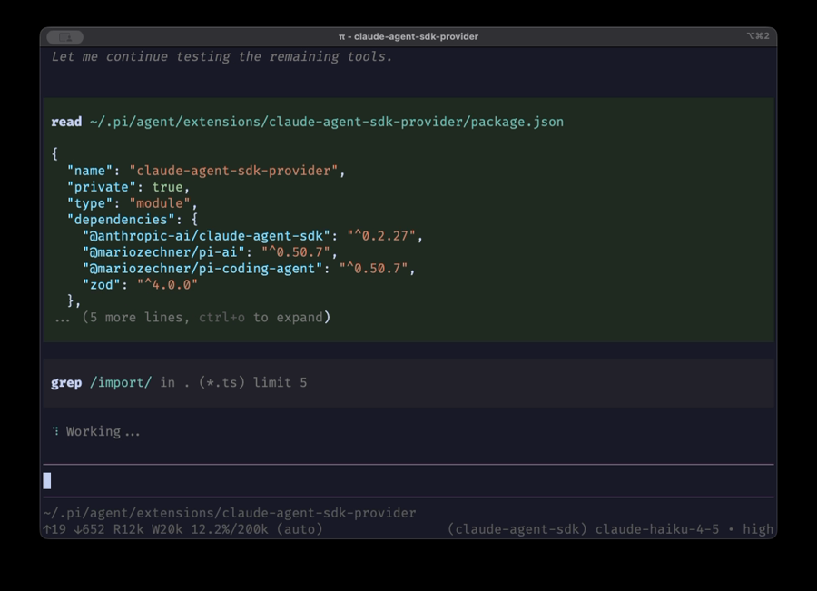

# claude-agent-sdk-pi

This extension registers a custom provider that routes LLM calls through the **Claude Agent SDK** while **pi executes tools** and renders tool results in the TUI.

## Highlights

- Claude Agent SDK is used as the LLM backend (Claude Code auth or API key).
- Tool execution is **blocked in Claude Code**; pi executes tools natively.
- Built-in tool calls are mapped to Claude Code tool names.
- Custom tools are exposed to Claude Code via in-process MCP.
- Skills can be appended to Claude Code’s default system prompt (optional).

## Demo



## Setup

1) Install the extension globally (npm is the preferred source now):

```
pi install npm:claude-agent-sdk-pi@latest
```

(You can omit `@latest` to use the latest version, or pin a specific version for reproducible installs.)

**Alternative (git):**

```
pi install git:github.com/prateekmedia/claude-agent-sdk-pi
```

See **pi-coding-agent** install docs for other install sources and paths.

2) **Authenticate** (choose one):

- **Claude Code login** (Pro/Max):
  ```bash
  npx @anthropic-ai/claude-code
  ```
  Ensure no API key env vars are set.

- **API key** (API plan):
  ```bash
  export ANTHROPIC_API_KEY=sk-ant-...
  ```

3) Reload pi:

```
/reload
```

## Provider ID

`claude-agent-sdk`

Use `/model` to select:
- `claude-agent-sdk/claude-opus-4-5`
- `claude-agent-sdk/claude-haiku-4-5`

## Tool Behavior

- Claude Code **proposes** tool calls.
- pi **executes** them.
- Tool execution in Claude Code is **denied**.

Built-in tool mapping (Claude Code → pi):

- Read → read
- Write → write
- Edit → edit
- Bash → bash
- Grep → grep
- Glob → find

Claude Code only sees the tools that are active in pi.

### Custom tools

Any extra tools registered in pi are exposed to Claude Code via an in-process MCP server:

- MCP server name: `custom-tools`
- Claude Code tool name format: `mcp__custom-tools__<toolName>`
- Example: `mcp__custom-tools__subagent`

The provider automatically maps these back to the pi tool name (e.g. `subagent`).

## Context loading

1) **Append to system prompt (Default)**
   - Uses **AGENTS.md + skills** from pi and appends to Claude Code’s preset prompt.
   - No extra config needed.

2) **Use Claude Code’s dir (Recommended)**
   - Set `appendSystemPrompt: false` so Claude Code loads its own resources.
   - It will look for `~/.claude/skills/` and `~/.claude/CLAUDE.md` (and project `.claude/`).
   - You can symlink your **pi skills** and **AGENTS.md** there.

   **Config:**
   ```json
   {
     "claudeAgentSdkProvider": {
       "appendSystemPrompt": false
     }
   }
   ```


   ```bash
   ln -s ~/.pi/agent/AGENTS.md ~/.claude/CLAUDE.md
   ln -s ~/.pi/agent/skills ~/.claude/skills
   ```
